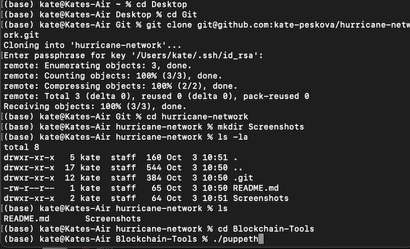
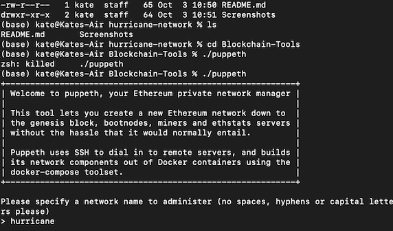
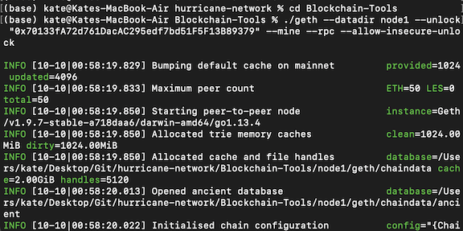

# hurricane-network
Setting up Hurricane blockchain test network

## Hurricane Network

In this project, we will create a blockchain on a test network from scratch. This blockchain will use Proof of Authority consensus.
Throughout the project, we will use a number of private and public keys. Please note, this is a fictitious network, created for testing and study purposes only. This network’s assets carry no monetary value. Thus, private keys are allowed to be shared. However, should you create a real prototype of this network, NEVER share any of the private mainnet keys, passwords, mnemonic phrases, etc.

**Preparing the tools**.  To kick things off, we would need to upload the blockchain tools. For this project, we would use the Go Etherium (Geth) tools, which can be found through this [link](https://geth.ethereum.org/downloads/). My operating system is Mac with M1 chip. Thus, I am choosing the version “Geth & Tools 1.9.7”. Once the packet is uploaded, unzip it and rename the folder as *Blockchain-Tools*. We will get back to these tools later.

**Creating MyCrypto hot wallet**. To create our brand-new network, we need a crypto wallet address. We would fetch the addresses after we create our nodes (this step will be explained further down). To be able to access our wallets through the UI, we would need to download and istall [MyCrypto](https://download.mycrypto.com/) app.

**Creating the node directories.** Once we are all set up with the tools, we can start building our blockchain. In order to do this, we would first create the node directories using “geth” command and create new wallet addresses within them.

1. To create the first node, type in the following command:
```
./geth account new --datadir node1
```
We may use the password for enhanced security.


Once the command is complete, make sure to backup public and private keys.

2. Repeat the process to create node2 replacing the node1 to node2 in the prompt:
```
./geth account new --datadir node2
```


**Creating the Genesis Block.** Now let’s create our genesis block in our soon-to-be blockchain.
1. Navigate to the Blockchain-Tools directory inside our project and type the command `./puppeth` .



2. Create a new network by typing its name as a command. In this project, we are creating the Hurricane network.



3. In the wizard, pick 2 to “Configure new genesis”.


4. Pick 1 to “Create new genesis from scratch”.


5. Since we are creating Proof of Authority network, pick 2 in the next prompt and choose the default 15-second timeframe for the block by hitting enter.


6. Now, let’s get back to our wallet addresses withing the nodes and copy them to seal the accounts (leave out 0x part).


7. Insert same addresses again in the pre-fund prompt, but choose _no_ to pre-fund option to keep genesis cleaner.


8. The last step in creating the genesis block is to declare a number to use it as a chain ID. In our case, it would be _177_.


**Preparing the chain to life.** To make the chain truly functional, we need to go through a few more steps.

1. First, let’s get back to the _puppeth_ prompt and select _Manage existing genesis_ by typing 2.


2. Second, we need to create our hurricane.json file to define the structure of our blockchain. To do so, select 2 in the next prompt, _Export genesis configurations_. Then choose the hurricane.json file and ignore the rest.


3.	Finally, let’s connect our nodes to the Hurricane network by initializing them. Use the following commands to initialize the nodes:
```
./geth init hurricane/hurricane.json --datadir node1

./geth init hurricane/hurricane.json --datadir node2
```


**Running the nodes.** We are ready to go live! Let’s run the nodes.

1. Both our nodes will need to run each in its own terminal window. For this, start fresh opening a new terminal window to run the first node. In the first window, navigate to our _Blockchain-Tools_ folder and run the following command:
```
./geth --datadir node1 --unlock "0x70133fA72d761DacAC295edf7bd51F5F13B89379" --mine --rpc --allow-insecure-unlock
```



2. To run the second node, we first need to locate the enode in the first node:


Once the enode has been located, open a new terminal window and run the following command that contains this enode:
```
./geth --datadir node2 --unlock "0xf16f4989cBd9D4fb2CDbdc815aa645BFEF09Bc02" --mine --port 30304 --bootnodes "enode://fa4610cdfc3f23ae43c9fc79c8a51703431d6bcd9ecbec52859e64b64657795eae57b80f3530ace9703ac02b90ba30a798a065bf9a4b26c95834b1316fc4b423@127.0.0.1:30303 " --ipcdisable --allow-insecure-unlock
```


The blockchain is now live and producing blocks.

